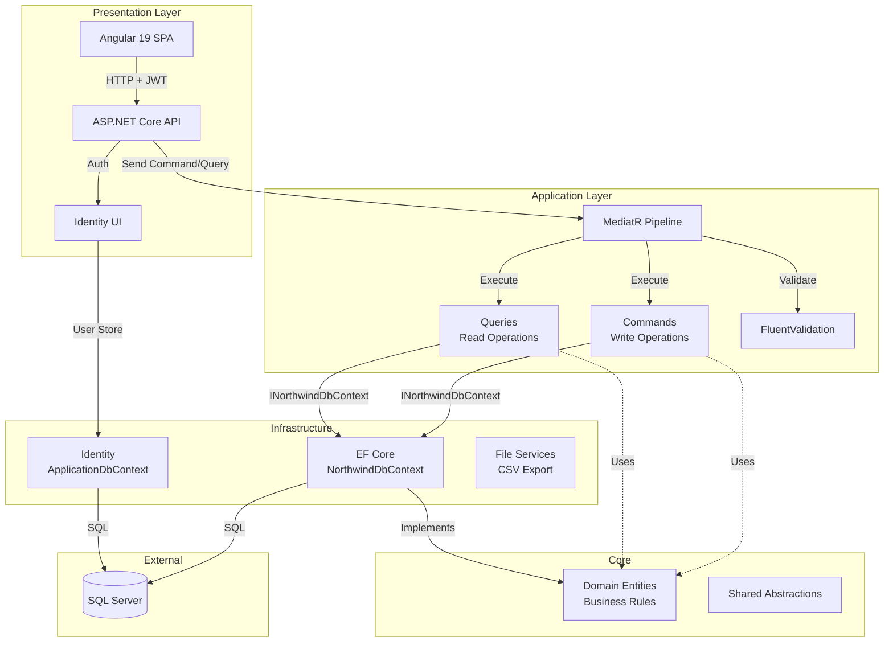
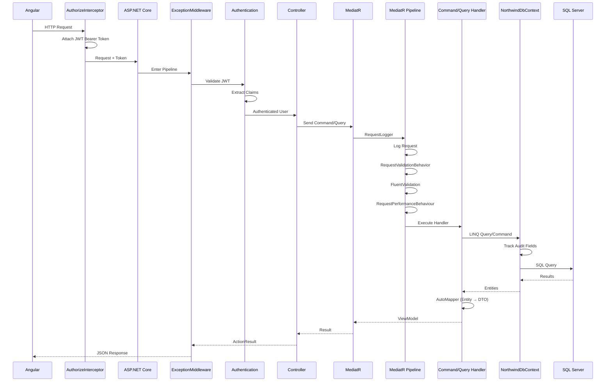
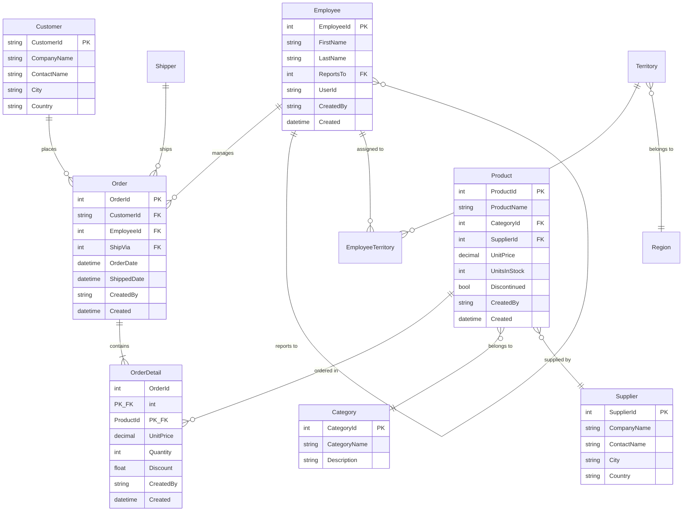

# Codebase Map

> Auto-generated by Cartographer. Last mapped: 2026-01-18

## System Overview

NorthwindTraders is a **Clean Architecture** reference implementation built with **.NET 8** and **Angular 19**. The application demonstrates CQRS (Command Query Responsibility Segregation), Domain-Driven Design (DDD), and separation of concerns across distinct architectural layers.

**Project Status**: Archived reference implementation
**Recommended Alternative**: [Clean Architecture Solution Template](https://github.com/jasontaylordev/CleanArchitecture)



**Architecture**: Clean Architecture with 6 projects following the Dependency Rule (dependencies point inward toward Domain).

## Directory Structure

```
NorthwindTraders/
├── .kiro/                          # Project documentation (product, structure, tech)
├── Src/
│   ├── Common/                     # Shared abstractions (IDateTime)
│   ├── Domain/                     # Enterprise business logic (13 entities)
│   │   ├── Common/                 # AuditableEntity, ValueObject base classes
│   │   ├── Entities/               # Business entities (Customer, Product, Order, etc.)
│   │   ├── ValueObjects/           # AdAccount domain value object
│   │   └── Exceptions/             # Domain-specific exceptions
│   ├── Application/                # Use cases, CQRS handlers (70 files)
│   │   ├── Common/                 # Behaviors, exceptions, interfaces, mappings
│   │   ├── Categories/             # Category commands & queries
│   │   ├── Customers/              # Customer CRUD operations
│   │   ├── Employees/              # Employee management
│   │   ├── Products/               # Product operations + CSV export
│   │   ├── Notifications/          # Notification models
│   │   └── System/                 # System commands (seed data)
│   ├── Infrastructure/             # External services implementation
│   │   ├── Identity/               # ASP.NET Identity + JWT auth
│   │   └── Files/                  # CSV file export with CsvHelper
│   ├── Persistence/                # Data access with EF Core
│   │   ├── Configurations/         # EF entity configurations (11 files)
│   │   └── Migrations/             # EF Core migrations
│   └── WebUI/                      # Presentation layer
│       ├── Controllers/            # API controllers (5 controllers)
│       ├── Areas/Identity/         # Login/Register pages
│       ├── Common/                 # Exception handler middleware
│       └── ClientApp/              # Angular 19 SPA
│           ├── src/app/            # Angular components
│           │   ├── home/
│           │   ├── customers/      # Customer list + detail
│           │   ├── products/       # Product list
│           │   └── northwind-traders-api.ts  # Auto-generated API client (17k tokens)
│           └── src/api-authorization/  # OIDC authentication module
└── Tests/
    ├── Application.UnitTests/
    ├── Domain.UnitTests/
    ├── Persistence.IntegrationTests/
    └── WebUI.IntegrationTests/
```

## Module Guide

### Common (`Src/Common`)

**Purpose**: Provides cross-cutting abstractions shared across all layers
**Entry point**: N/A (library)
**Key files**:

| File | Purpose | Tokens |
|------|---------|--------|
| IDateTime.cs | DateTime abstraction for testability | 27 |

**Exports**: `IDateTime` interface
**Dependencies**: None
**Dependents**: Domain, Application, Infrastructure, Persistence

---

### Domain (`Src/Domain`)

**Purpose**: Contains enterprise business rules, entities, value objects - the heart of the application with zero dependencies

**Entry point**: N/A (library)
**Key files**:

| File | Purpose | Tokens |
|------|---------|--------|
| Common/AuditableEntity.cs | Base class for audit tracking (Created, CreatedBy, Modified, ModifiedBy) | 67 |
| Common/ValueObject.cs | DDD Value Object base with structural equality | 339 |
| Entities/Customer.cs | Customer entity | 165 |
| Entities/Product.cs | Product entity (AuditableEntity) | 204 |
| Entities/Order.cs | Order entity (AuditableEntity) | 260 |
| Entities/Employee.cs | Employee entity with manager relationship | 326 |
| ValueObjects/AdAccount.cs | Active Directory account value object (DOMAIN\Username) | 247 |

**Exports**:
- 13 domain entities (Customer, Product, Order, OrderDetail, Employee, Category, Supplier, Shipper, Territory, Region, EmployeeTerritory)
- Base classes: `AuditableEntity`, `ValueObject`
- Domain exceptions: `AdAccountInvalidException`

**Dependencies**: None (pure .NET 8)
**Dependents**: Application, Persistence

**Patterns**:
- **Auditable Entities**: Product, Employee, Order, OrderDetail inherit from `AuditableEntity` for automatic audit trail
- **Value Objects**: `AdAccount` demonstrates DDD Value Object pattern with structural equality
- **Self-Referencing**: Employee has `ReportsTo` → `Manager` relationship

---

### Application (`Src/Application`)

**Purpose**: Contains all application business logic, use cases implemented as CQRS commands and queries. Defines interfaces for infrastructure concerns.

**Entry point**: `DependencyInjection.cs` registers MediatR, AutoMapper, FluentValidation
**Key files**:

| File | Purpose | Tokens |
|------|---------|--------|
| Common/Behaviours/RequestLogger.cs | Pre-processor logging all MediatR requests | 170 |
| Common/Behaviours/RequestPerformanceBehaviour.cs | Logs warnings for requests >500ms | 251 |
| Common/Behaviours/RequestValidationBehavior.cs | FluentValidation pipeline behavior | 223 |
| Common/Interfaces/INorthwindDbContext.cs | Database context interface | 184 |
| Common/Mappings/MappingProfile.cs | AutoMapper convention-based configuration | 160 |
| Customers/Commands/CreateCustomer/CreateCustomerCommand.cs | Create customer command + handler | 365 |
| Products/Queries/GetProductsFile/GetProductsFileQueryHandler.cs | CSV export query handler | 278 |

**Exports**:
- **Commands**: Create, Update, Delete operations for Categories, Customers, Employees, Products
- **Queries**: List and detail queries for all entities
- **Interfaces**: `INorthwindDbContext`, `ICurrentUserService`, `IUserManager`, `ICsvFileBuilder`, `INotificationService`
- **Exceptions**: `NotFoundException`, `ValidationException`, `BadRequestException`, `DeleteFailureException`

**Dependencies**: Domain, Common, NuGet (MediatR, AutoMapper, FluentValidation, EF Core interfaces only)
**Dependents**: WebUI, Infrastructure, Persistence

**Patterns**:
- **CQRS**: Clear separation of Commands (write) and Queries (read)
- **MediatR Pipeline**: RequestLogger → Validation → Performance monitoring → Handler
- **FluentValidation**: Validators auto-discovered and registered for commands
- **AutoMapper**: Convention-based mapping using `IMapFrom<T>` interface
- **Domain Events**: `CustomerCreated` published after customer creation

**Naming Conventions**:
- Commands: `{Verb}{Entity}Command` (e.g., `CreateCustomerCommand`)
- Queries: `Get{Entity}{Details}Query` (e.g., `GetCustomersListQuery`)
- ViewModels: `{Entity}{Context}Vm` (e.g., `CustomersListVm`)
- DTOs: `{Entity}Dto` or `{Entity}LookupDto`

---

### Infrastructure (`Src/Infrastructure`)

**Purpose**: Implements application interfaces for external concerns - Identity, Authentication, File operations

**Entry point**: `DependencyInjection.cs` registers Identity, JWT auth, file services
**Key files**:

| File | Purpose | Tokens |
|------|---------|--------|
| Identity/ApplicationDbContext.cs | Identity EF Core DbContext | 49 |
| Identity/UserManagerService.cs | IUserManager implementation | 236 |
| Files/CsvFileBuilder.cs | CSV export using CsvHelper | 156 |
| DependencyInjection.cs | Service registration (Identity, JWT, services) | 448 |

**Exports**:
- `UserManagerService` implementing `IUserManager`
- `CsvFileBuilder` implementing `ICsvFileBuilder`
- `MachineDateTime` implementing `IDateTime`
- `NotificationService` implementing `INotificationService`

**Dependencies**: Application (interfaces), Common, NuGet (ASP.NET Identity, JWT Bearer, CsvHelper, EF Core)
**Dependents**: WebUI

**Configuration**:
- **Identity**: ASP.NET Core Identity with `ApplicationUser : IdentityUser`
- **JWT Authentication**: Bearer token with symmetric key validation
- **Token Settings**: Configurable via `appsettings.json` → `JwtSettings:SecretKey`

---

### Persistence (`Src/Persistence`)

**Purpose**: Data access implementation using Entity Framework Core - DbContext, entity configurations, migrations

**Entry point**: `DependencyInjection.cs` registers `NorthwindDbContext`
**Key files**:

| File | Purpose | Tokens |
|------|---------|--------|
| NorthwindDbContext.cs | Main DbContext with audit trail automation | 443 |
| Configurations/*.cs | Fluent API entity configurations (11 files) | ~2000 |
| NorthwindDbContextFactory.cs | Design-time factory for migrations | 63 |

**Exports**:
- `NorthwindDbContext` implementing `INorthwindDbContext`
- Entity configurations for all 13 domain entities

**Dependencies**: Application (INorthwindDbContext), Domain (entities), Infrastructure (ApplicationDbContext ref), NuGet (EF Core SQL Server, InMemory)
**Dependents**: WebUI

**Key Features**:
- **Automatic Audit Trail**: `SaveChangesAsync` override populates Created/Modified fields using `ICurrentUserService` and `IDateTime`
- **Convention-Based Configuration**: `ApplyConfigurationsFromAssembly()` auto-discovers all `IEntityTypeConfiguration<T>`
- **Dual Database Support**: SQL Server (production) or In-Memory (testing) via `appsettings.json` → `UseInMemoryDatabase`
- **Migrations**: 4 migrations tracking schema evolution

**Entity Configurations**: Each entity has dedicated Fluent API configuration for:
- Primary keys and composite keys
- Foreign key relationships
- Column types and constraints
- Indexes
- Default values

---

### WebUI (`Src/WebUI`)

**Purpose**: Presentation layer hosting ASP.NET Core Web API and Angular SPA - application entry point

**Entry point**: `Program.cs` → `Startup.cs`
**Key files**:

| File | Purpose | Tokens |
|------|---------|--------|
| Program.cs | Application bootstrap, DB initialization, data seeding | ~150 |
| Common/CustomExceptionHandlerMiddleware.cs | Global exception handler | 320 |
| Controllers/BaseController.cs | Base controller with MediatR injection | 78 |
| Controllers/CustomersController.cs | Customer API endpoints | 369 |
| Controllers/ProductsController.cs | Product API endpoints + CSV export | 394 |
| ClientApp/src/app/northwind-traders-api.ts | NSwag auto-generated TypeScript client | 17247 |

**Backend Exports**:
- **CategoriesController**: GET list, POST create, PUT update, DELETE
- **CustomersController**: GET list, GET detail, POST create, PUT update, DELETE
- **EmployeesController**: GET list, GET detail, POST upsert, DELETE
- **ProductsController**: GET list, GET detail, POST create, PUT update, DELETE, GET CSV export
- **OidcConfigurationController**: OIDC configuration endpoint

**Frontend Components**:
- **HomeComponent**: Landing page
- **CustomersComponent**: Customer list with modal detail view
- **CustomerDetailComponent**: Customer detail modal
- **ProductsComponent**: Product list
- **Navigation**: Top menu + side menu components

**Dependencies**: All layers (Infrastructure, Persistence, Application, Domain, Common)
**Dependents**: None (top-level)

**Configuration**:
- **Middleware Pipeline**: Exception Handler → HTTPS Redirect → Static Files → Routing → Authentication → Authorization → Endpoints → SPA
- **Swagger/OpenAPI**: Available at `/api` endpoint
- **SPA**: Angular dev server proxied in development, static files served in production
- **Health Checks**: Available at `/health`

**Authentication Flow**:
1. Angular `AuthorizeInterceptor` attaches JWT Bearer token to requests
2. ASP.NET Core `Authentication` middleware validates JWT
3. `CurrentUserService` extracts user from claims
4. Controllers use `[Authorize]` attribute for protection

**Exception Translation**:
- `NotFoundException` → 404 Not Found
- `ValidationException` → 400 Bad Request (with validation details)
- `BadRequestException` → 400 Bad Request
- `DeleteFailureException` → 400 Bad Request (with reason)
- Unhandled exceptions → 500 Internal Server Error

---

### Angular Frontend (`Src/WebUI/ClientApp`)

**Purpose**: Single-Page Application for Northwind Traders

**Entry point**: `src/main.ts` → `app.module.ts`
**Key files**:

| File | Purpose | Tokens |
|------|---------|--------|
| src/app/app.module.ts | Root module configuration | 407 |
| src/app/northwind-traders-api.ts | NSwag-generated API clients | 17247 |
| src/api-authorization/authorize.service.ts | OIDC authentication service | 2140 |
| src/api-authorization/authorize.interceptor.ts | JWT token interceptor | 395 |
| src/api-authorization/authorize.guard.ts | Route guard | 217 |

**Technology Stack**:
- **Angular**: 19.0.0
- **UI Components**: ngx-bootstrap 18.0.2
- **Icons**: angular-feather 6.5.0
- **Authentication**: oidc-client-ts 3.1.0
- **HTTP**: HttpClient with interceptors

**API Integration**:
- **NSwag**: Auto-generates TypeScript clients from OpenAPI spec
- **Type Safety**: End-to-end type safety from C# DTOs to TypeScript interfaces
- **Clients**: `CategoriesClient`, `CustomersClient`, `EmployeesClient`, `ProductsClient`

**Authentication**:
- **Module**: `ApiAuthorizationModule` handles OIDC flow
- **Guard**: `AuthorizeGuard` protects routes requiring authentication
- **Interceptor**: `AuthorizeInterceptor` attaches Bearer tokens to same-origin requests
- **Service**: `AuthorizeService` manages login/logout/token refresh

**Routing**:
```typescript
/ (Home) - Public
/customers - Protected (requires AuthorizeGuard)
/products - Public
/authentication/login - OIDC login
/authentication/logout - OIDC logout
```

---

## Data Flow

### HTTP Request → Database → Response Flow



### Example: Create Customer Flow

1. **Angular Component**: User submits form
   ```typescript
   this.client.create(command).subscribe(...)
   ```

2. **HTTP Request**: `POST /api/Customers/Create` with JWT Bearer token

3. **Authentication Middleware**: Validates JWT, extracts user claims

4. **Controller**:
   ```csharp
   await Mediator.Send(command);
   ```

5. **MediatR Pipeline**:
   - `RequestLogger` logs command details
   - `RequestValidationBehavior` validates using `CreateCustomerCommandValidator`
   - `RequestPerformanceBehaviour` monitors execution time
   - `CreateCustomerCommand.Handler` executes

6. **Handler Execution**:
   ```csharp
   var entity = new Customer { ... };
   _context.Customers.Add(entity);
   await _context.SaveChangesAsync(cancellationToken);
   await _mediator.Publish(new CustomerCreated { CustomerId = entity.CustomerId });
   ```

7. **SaveChangesAsync Override**:
   - Detects new `Customer` entity
   - Sets `CreatedBy = currentUser.UserId`
   - Sets `Created = DateTime.Now`
   - Executes SQL INSERT

8. **Response**: 204 No Content returned to Angular

9. **Domain Event**: `CustomerCreated` published for side effects

---

## Entity Relationships



### Entity Details

**Entities with Audit Trails** (inherit `AuditableEntity`):
- Product
- Employee
- Order
- OrderDetail

**Junction Tables**:
- `OrderDetail` (Order ↔ Product): Composite key (OrderId, ProductId)
- `EmployeeTerritory` (Employee ↔ Territory): Composite key (EmployeeId, TerritoryId)

**Self-Referencing**:
- `Employee.ReportsTo` → `Employee.Manager` (nullable)
- `Employee.DirectReports` collection

**Special Fields**:
- `Employee.UserId`: Links to ASP.NET Identity `ApplicationUser.Id`
- `Order.ShipVia`: FK to `Shipper.ShipperId`

**Business Rules**:
- Cannot delete Customer if has Orders (DeleteFailureException)
- Cannot delete Product if in OrderDetails (DeleteFailureException)
- Employee can have null Manager (top-level employee)

---

## Conventions

### CQRS Naming

**Commands** (Write Operations):
- Format: `{Verb}{Entity}Command`
- Examples: `CreateCustomerCommand`, `UpdateProductCommand`, `DeleteEmployeeCommand`
- Return: `void`, `Unit`, or entity ID
- Location: `Application/{Entity}/Commands/{CommandName}/`

**Queries** (Read Operations):
- Format: `Get{Entity}{Details}Query`
- Examples: `GetCustomersListQuery`, `GetProductDetailQuery`
- Return: ViewModel (`*Vm`) or DTO
- Location: `Application/{Entity}/Queries/{QueryName}/`

**ViewModels**:
- Format: `{Entity}{Context}Vm`
- Examples: `CustomersListVm`, `ProductDetailVm`
- Purpose: Query result containers

**DTOs**:
- Format: `{Entity}Dto` or `{Entity}LookupDto`
- Examples: `CustomerLookupDto`, `ProductRecordDto`
- Purpose: Data transfer objects for mapping

### Validation

- **Validator Class**: `{CommandName}Validator`
- **Inheritance**: `AbstractValidator<TCommand>`
- **Example**: `CreateCustomerCommandValidator : AbstractValidator<CreateCustomerCommand>`
- **Registration**: Auto-discovered by `AddValidatorsFromAssembly()`

### Entity Configuration

- **File**: `{Entity}Configuration.cs`
- **Interface**: `IEntityTypeConfiguration<TEntity>`
- **Location**: `Persistence/Configurations/`
- **Discovery**: Auto-applied via `ApplyConfigurationsFromAssembly()`

### AutoMapper

- **Convention**: Implement `IMapFrom<TSource>` on DTOs
- **Method**: `void Mapping(Profile profile)`
- **Default**: Same property names map automatically
- **Custom Mappings**: Use `profile.CreateMap<>().ForMember()`

### Dependency Injection

Each layer has `DependencyInjection.cs` with extension method:
```csharp
public static IServiceCollection AddApplication(this IServiceCollection services)
public static IServiceCollection AddInfrastructure(...)
public static IServiceCollection AddPersistence(...)
```

Called in order from `Startup.cs`:
1. `AddInfrastructure()` - Identity, JWT, external services
2. `AddPersistence()` - DbContext
3. `AddApplication()` - MediatR, AutoMapper, Validation

---

## Gotchas

### Audit Trail Limitation
- Only entities inheriting `AuditableEntity` get automatic audit fields
- `Customer`, `Category`, `Supplier`, `Shipper`, `Region`, `Territory` have NO audit trail
- To add audit trail: Make entity inherit from `AuditableEntity` and create migration

### In-Memory Database Quirks
- When `UseInMemoryDatabase: true`, migrations are skipped
- Uses `Database.EnsureCreated()` instead of `Database.Migrate()`
- Relational constraints not fully enforced (cascade deletes may behave differently)
- Good for testing, but test against real SQL Server before deployment

### JWT Secret Key
- **Critical**: Change default secret key in `appsettings.json` → `JwtSettings:SecretKey`
- Must be at least 32 characters for HS256
- Default key in template is insecure for production

### NSwag Client Regeneration
- Auto-generated file: `ClientApp/src/app/northwind-traders-api.ts`
- Regenerate after API changes: `npm run nswag` in `ClientApp/` directory
- Configuration: `ClientApp/nswag.json`
- Requires running API to fetch OpenAPI spec

### Employee.UserId Mapping
- `Employee.UserId` links to Identity system but is nullable
- Not all employees may have user accounts
- Check for null before accessing Identity features
- Relationship not enforced via FK (cross-database)

### Performance Behavior Threshold
- `RequestPerformanceBehaviour` logs warnings for requests >500ms
- Threshold configured in behavior class (hardcoded)
- Consider making configurable via `appsettings.json` for production tuning

### FluentValidation Pipeline Order
- Validation runs BEFORE handler execution
- `ValidationException` thrown immediately on failure
- Handler never executes if validation fails
- Ensure validators cover all business rules that should prevent execution

### Exception Middleware
- Catches ALL exceptions in pipeline
- Custom exceptions translated to appropriate HTTP codes
- Unhandled exceptions return 500 with no details (security)
- Add custom exception types to middleware for specific handling

### Migration Caution
- Two separate migration histories:
  - `NorthwindDbContext` (business data)
  - `ApplicationDbContext` (identity)
- Both applied on startup in `Program.cs`
- Must manage both when deploying schema changes

### CORS Not Configured
- Template assumes SPA served from same origin
- If deploying Angular separately, configure CORS in `Startup.cs`
- Add: `services.AddCors()` and `app.UseCors()`

---

## Navigation Guide

### To add a new API endpoint for existing entity

1. **Application Layer**: Create command or query
   - `Src/Application/{Entity}/Commands|Queries/{OperationName}/`
   - Create `{Operation}Command.cs` or `{Operation}Query.cs`
   - Add handler as nested class or separate file
   - Create validator if needed: `{Operation}Validator.cs`

2. **WebUI Layer**: Add controller action
   - `Src/WebUI/Controllers/{Entity}Controller.cs`
   - Add action method that sends command/query via MediatR

3. **Frontend**: Regenerate API client
   - Run: `npm run nswag` in `ClientApp/` directory
   - New TypeScript method appears in `northwind-traders-api.ts`

**Example Files**:
- Command: `Src/Application/Products/Commands/CreateProduct/CreateProductCommand.cs`
- Controller: `Src/WebUI/Controllers/ProductsController.cs:51`
- Client: `Src/WebUI/ClientApp/src/app/northwind-traders-api.ts:1200`

---

### To add a new domain entity

1. **Domain Layer**: Create entity
   - `Src/Domain/Entities/{Entity}.cs`
   - Inherit from `AuditableEntity` if audit trail needed
   - Define properties and relationships

2. **Persistence Layer**: Configure entity
   - `Src/Persistence/Configurations/{Entity}Configuration.cs`
   - Implement `IEntityTypeConfiguration<{Entity}>`
   - Configure keys, relationships, constraints

3. **Application Layer**: Add to DbContext interface
   - `Src/Application/Common/Interfaces/INorthwindDbContext.cs`
   - Add `DbSet<{Entity}> {Entities} { get; set; }`

4. **Persistence Layer**: Implement DbContext property
   - `Src/Persistence/NorthwindDbContext.cs`
   - Add `public DbSet<{Entity}> {Entities} { get; set; }`

5. **Create Migration**:
   ```bash
   dotnet ef migrations add Add{Entity} --project Src/Persistence --startup-project Src/WebUI
   ```

6. **Apply Migration**:
   ```bash
   dotnet ef database update --project Src/Persistence --startup-project Src/WebUI
   ```

7. **Application Layer**: Create CRUD operations
   - Commands: Create, Update, Delete
   - Queries: GetList, GetDetail
   - Validators
   - DTOs/ViewModels

8. **WebUI Layer**: Create controller
   - `Src/WebUI/Controllers/{Entity}Controller.cs`
   - Inherit from `BaseController`
   - Add CRUD actions

9. **Frontend**: Create components
   - `ClientApp/src/app/{entity}/` directory
   - List component
   - Detail component
   - Add routes to `app.routing.module.ts`

**Reference Files**:
- Entity: `Src/Domain/Entities/Product.cs:1`
- Configuration: `Src/Persistence/Configurations/ProductConfiguration.cs:1`
- Commands: `Src/Application/Products/Commands/`
- Controller: `Src/WebUI/Controllers/ProductsController.cs:1`

---

### To modify authentication/authorization

**Backend - JWT Configuration**:
- `Src/Infrastructure/DependencyInjection.cs:100` - JWT settings
- `Src/WebUI/appsettings.json` - Secret key configuration
- `Src/WebUI/Controllers/{Controller}.cs` - Add `[Authorize]` or `[AllowAnonymous]`

**Frontend - OIDC Configuration**:
- `Src/WebUI/ClientApp/src/api-authorization/api-authorization.constants.ts:1` - OIDC settings
- `Src/WebUI/ClientApp/src/api-authorization/authorize.service.ts:1` - Auth logic
- `Src/WebUI/ClientApp/src/api-authorization/authorize.guard.ts:1` - Route protection
- `Src/WebUI/ClientApp/src/app/app.routing.module.ts` - Add `canActivate: [AuthorizeGuard]`

**Identity UI**:
- `Src/WebUI/Areas/Identity/Pages/Account/Login.cshtml:1` - Login page
- `Src/WebUI/Areas/Identity/Pages/Account/Register.cshtml:1` - Registration page

**Current User Service**:
- `Src/WebUI/Services/CurrentUserService.cs` - Extracts user from HTTP context
- `Src/Application/Common/Interfaces/ICurrentUserService.cs:1` - Interface definition

---

### To add CSV export for new entity

1. **Application Layer**: Create query and DTO
   - `Src/Application/{Entity}/Queries/Get{Entity}File/Get{Entity}FileQuery.cs`
   - `Src/Application/{Entity}/Queries/Get{Entity}File/{Entity}RecordDto.cs`
   - `Src/Application/{Entity}/Queries/Get{Entity}File/{Entity}FileVm.cs`

2. **Infrastructure Layer**: Create CSV mapping
   - `Src/Infrastructure/Files/{Entity}FileRecordMap.cs`
   - Inherit from `ClassMap<{Entity}RecordDto>`

3. **Application Layer**: Update CSV builder interface (optional)
   - `Src/Application/Common/Interfaces/ICsvFileBuilder.cs`
   - Add method: `byte[] Build{Entity}File(IEnumerable<{Entity}RecordDto> records)`

4. **Infrastructure Layer**: Implement CSV builder
   - `Src/Infrastructure/Files/CsvFileBuilder.cs`
   - Add implementation method

5. **WebUI Layer**: Add controller endpoint
   - Add action returning `FileResult` with `Content-Disposition` header

**Reference Files**:
- Query: `Src/Application/Products/Queries/GetProductsFile/GetProductsFileQuery.cs:1`
- DTO: `Src/Application/Products/Queries/GetProductsFile/ProductRecordDto.cs:1`
- Mapping: `Src/Infrastructure/Files/ProductFileRecordMap.cs:1`
- Controller: `Src/WebUI/Controllers/ProductsController.cs:78`

---

### To modify validation rules

1. **Find validator**:
   - `Src/Application/{Entity}/Commands/{Command}/{Command}Validator.cs`

2. **Modify rules**:
   ```csharp
   RuleFor(x => x.PropertyName)
       .NotEmpty()
       .MaximumLength(100)
       .WithMessage("Custom error message");
   ```

3. **FluentValidation Methods**:
   - `NotEmpty()`, `NotNull()`
   - `Length(min, max)`, `MaximumLength(max)`, `MinimumLength(min)`
   - `EmailAddress()`, `CreditCard()`, `Matches(regex)`
   - `Must(predicate)` - Custom validation logic
   - `WithMessage(message)` - Custom error message

4. **Async Validation** (e.g., check database):
   ```csharp
   RuleFor(x => x.CustomerId)
       .MustAsync(async (id, ct) => await context.Customers.AnyAsync(c => c.Id == id, ct))
       .WithMessage("Customer does not exist");
   ```

**Reference Files**:
- Validator: `Src/Application/Customers/Commands/CreateCustomer/CreateCustomerCommandValidator.cs:1`
- Behavior: `Src/Application/Common/Behaviours/RequestValidationBehavior.cs:1`

---

### To add logging or monitoring

**Request Logging**:
- `Src/Application/Common/Behaviours/RequestLogger.cs:1` - Logs all MediatR requests

**Performance Monitoring**:
- `Src/Application/Common/Behaviours/RequestPerformanceBehaviour.cs:1` - Warns on slow requests (>500ms)

**Configure Logging** (`appsettings.json`):
```json
{
  "Logging": {
    "LogLevel": {
      "Default": "Information",
      "Microsoft": "Warning",
      "Microsoft.Hosting.Lifetime": "Information"
    }
  }
}
```

**Add Custom Logging in Handler**:
```csharp
public class MyCommandHandler : IRequestHandler<MyCommand>
{
    private readonly ILogger<MyCommandHandler> _logger;

    public async Task Handle(MyCommand request, CancellationToken ct)
    {
        _logger.LogInformation("Executing MyCommand with Id: {Id}", request.Id);
        // ... logic
    }
}
```

---

### To switch from SQL Server to In-Memory database (testing)

1. **Modify appsettings.json** (or appsettings.Test.json):
   ```json
   {
     "UseInMemoryDatabase": true
   }
   ```

2. **Run tests** - both contexts will use in-memory provider

3. **Note**: Migrations are skipped, `Database.EnsureCreated()` used instead

**Configuration Location**:
- `Src/Persistence/DependencyInjection.cs:25` - In-memory database setup

---

### To seed initial data

**Seed Command**:
- `Src/Application/System/Commands/SeedSampleData/SeedSampleDataCommand.cs:1`

**Executed on startup**:
- `Src/WebUI/Program.cs:20` - Runs seed command after migrations

**Modify seeding**:
1. Update `SeedSampleDataCommand.Handler`
2. Add entities to DbContext
3. Call `SaveChangesAsync()`

---

### To run the application

1. **Restore Dependencies**:
   ```bash
   dotnet restore
   cd Src/WebUI/ClientApp && npm install
   ```

2. **Apply Migrations** (first time):
   ```bash
   dotnet ef database update --project Src/Persistence --startup-project Src/WebUI
   ```

3. **Run Backend**:
   ```bash
   cd Src/WebUI
   dotnet run
   ```
   - API: `https://localhost:5001`
   - Swagger: `https://localhost:5001/api`

4. **Run Frontend** (development):
   ```bash
   cd Src/WebUI/ClientApp
   npm start
   ```
   - Angular Dev Server: `http://localhost:4200`

5. **Production**: Backend serves compiled Angular app from `/dist`

---

## Technology Stack Summary

### Backend (.NET 8)
- **Framework**: ASP.NET Core 8.0
- **ORM**: Entity Framework Core 8.0
- **Database**: SQL Server (configurable to In-Memory for testing)
- **CQRS/Mediator**: MediatR 12.2.0
- **Validation**: FluentValidation 11.8.0
- **Mapping**: AutoMapper 12.0.1
- **Authentication**: ASP.NET Core Identity + JWT Bearer
- **API Documentation**: NSwag 14.0.0 (OpenAPI/Swagger)
- **File Export**: CsvHelper 30.0.1

### Frontend (Angular 19)
- **Framework**: Angular 19.0.0
- **Authentication**: oidc-client-ts 3.1.0
- **UI Components**: ngx-bootstrap 18.0.2
- **Icons**: angular-feather 6.5.0
- **HTTP**: Angular HttpClient with interceptors
- **API Client**: NSwag auto-generated TypeScript client

### Testing
- **Unit Testing**: xUnit (implied by test project structure)
- **Integration Testing**: EF Core In-Memory provider
- **Mocking**: Moq (common in .NET testing)

---

## Getting Started Checklist

- [ ] Clone repository
- [ ] Install .NET 8 SDK
- [ ] Install Node.js 18+ and npm
- [ ] Restore .NET dependencies: `dotnet restore`
- [ ] Restore npm dependencies: `cd Src/WebUI/ClientApp && npm install`
- [ ] Update connection string in `Src/WebUI/appsettings.json`
- [ ] Change JWT secret key in `Src/WebUI/appsettings.json` (production)
- [ ] Apply migrations: `dotnet ef database update --project Src/Persistence --startup-project Src/WebUI`
- [ ] Run application: `cd Src/WebUI && dotnet run`
- [ ] Open browser: `https://localhost:5001`
- [ ] Explore API: `https://localhost:5001/api` (Swagger UI)
- [ ] Review seeded data (sample customers, products, etc.)

---

## Additional Resources

- **Original Repository**: [jasontaylordev/NorthwindTraders](https://github.com/jasontaylordev/NorthwindTraders) (archived)
- **Clean Architecture Template**: [jasontaylordev/CleanArchitecture](https://github.com/jasontaylordev/CleanArchitecture) (actively maintained)
- **Clean Architecture Principles**: [Uncle Bob's Clean Architecture](https://blog.cleancoder.com/uncle-bob/2012/08/13/the-clean-architecture.html)
- **CQRS Pattern**: [Martin Fowler - CQRS](https://martinfowler.com/bliki/CQRS.html)
- **MediatR Documentation**: [github.com/jbogard/MediatR](https://github.com/jbogard/MediatR)
- **EF Core Documentation**: [docs.microsoft.com/ef/core](https://docs.microsoft.com/ef/core)

---

*This codebase map was auto-generated by Cartographer. For questions or updates, regenerate the map or refer to inline code documentation.*
